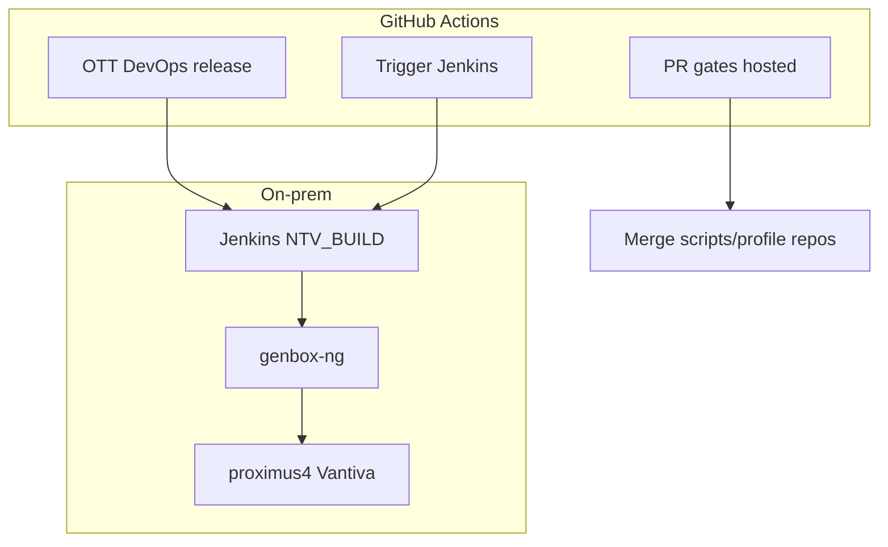

# OTT DevOps — GitHub Actions

Over-the-top (IPTV / NTV) firmware DevOps workflows on GitHub, integrated with on-prem Jenkins, genbox, and Vantiva.

## Architecture



## Workflows in this repo

| Workflow | Runner | Purpose |
|----------|--------|---------|
| `ci.yml` | Hosted | Pilot repo PR/push checks |
| `reusable-ott-pr-gates.yml` | Hosted | **Reusable** — call from other repos |
| `trigger-jenkins.yml` | Self-hosted | Manual Jenkins trigger with presets |
| `ott-devops-release.yml` | Mixed | **OTT release orchestration** |
| `runner-smoke.yml` | Self-hosted | Runner + Jenkins connectivity test |

## OTT DevOps release (main workflow)

**Actions → OTT DevOps release → Run workflow**

| Operation | What it does |
|-------------|--------------|
| `validate_only` | Print pipeline map; check setup |
| `trigger_jenkins` | Queue NTV_BUILD and exit |
| `trigger_and_wait` | Trigger + poll until SUCCESS/FAILURE |
| `full_release_notes` | Trigger + wait + print Vantiva steps for proximus4 |

### Example: full dev build + wait

| Input | Value |
|-------|--------|
| operation | `trigger_and_wait` |
| project_name | `NTVBE_master` |
| target_name | `ntv-mv5` |
| build_preset | `full_dev_build` |
| wait_timeout_minutes | `240` |

## Use PR gates in other repos

In `utilities-scripts` or `jenkins_script_53` `.github/workflows/ci.yml`:

```yaml
name: CI
on:
  pull_request:
    branches: [master]
  push:
    branches: [master]

jobs:
  ott-gates:
    uses: agupta47tv/ntv-actions-pilot/.github/workflows/reusable-ott-pr-gates.yml@main
```

## Secrets (ntv-actions-pilot only)

| Secret | Purpose |
|--------|---------|
| `JENKINS_URL` | `http://10.67.254.53:8080` |
| `JENKINS_USER` | Jenkins API user |
| `JENKINS_TOKEN` | Jenkins API token |

Do **not** store Artifactory tokens or signing keys in GitHub long-term — use Vault on proximus4.

## What stays on-prem

| Step | Host |
|------|------|
| genbox build, Apply Security | Jenkins / build farm |
| Artifactory inbox/outbox | proximus4 |
| Vault | proximus4 |

## Repo mirror map

| Internal | GitHub |
|----------|--------|
| `scm/utilities-scripts.git` | `agupta47tv/utilities-scripts` |
| `tools/jenkins_script_53.git` | `agupta47tv/jenkins_script_53` |
| Hub / orchestration | `agupta47tv/ntv-actions-pilot` |

## Future

- Self-hosted runner on **proximus4** for automated `artifactory-sync.sh`
- Profile diff job when `genbox_nte-profile` is mirrored
- Slack/Teams notify on workflow completion
